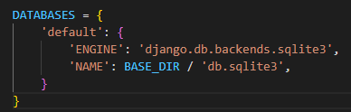
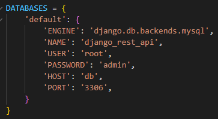
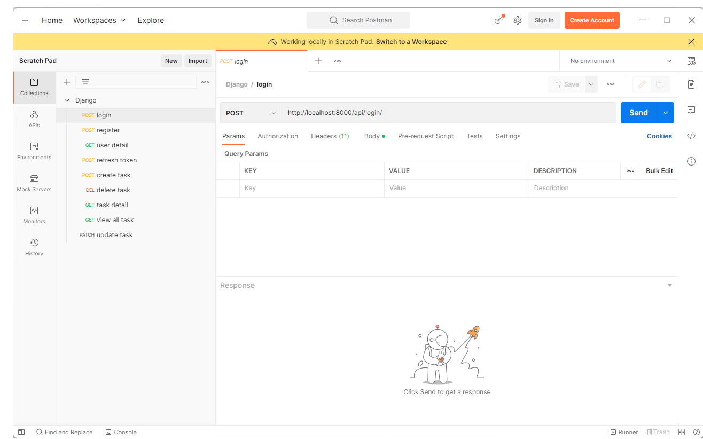

# Django Rest Framework API TODO LIST

- This is a simple example of a REST API using DjangoTemplates.

- In this project I will use sqlite to save data in local and use mysql database if run with docker.

## Installation

    python 3.6 +
    django >=4.0.0, <4.1.0
    djangorestframework
    djangorestframework-simplejwt
    mysqlclient == 2.1.1

## How to run in local database with sqlite

Change your settings files in this dir "work_list\work_list\settings.py " like this:

### Run command
Step 1 - Installation using pip:

    pip install -r requirements.txt

Step 2 - Migrations database:

    python manage.py makemigrations
    python manage.py migrate

Step 3 - Run server:

    cd work_list
    python manage.py runserver #this server will run with port 8000

## How to run in docker

Change your settings files in this dir "work_list\work_list\settings.py " like this:

### Run command

Step 1 - Installation <a href="https://docs.docker.com/desktop/">docker</a> (Recommended using docker version 4.4.3)

Step 2 - Run this command:
    
    cd work_list
    docker-compose up --build

## Post-man

Using <a href='https://www.postman.com/'>post man</a> application to check api

Import file Django.postman_collection.json into your postman application to get my curl 

